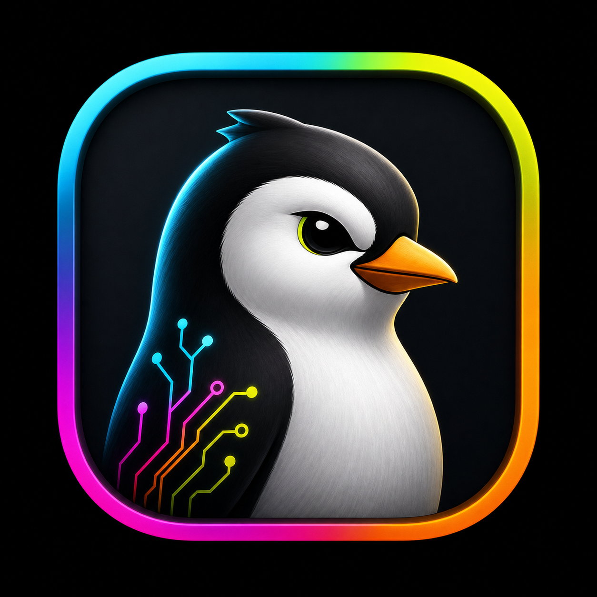
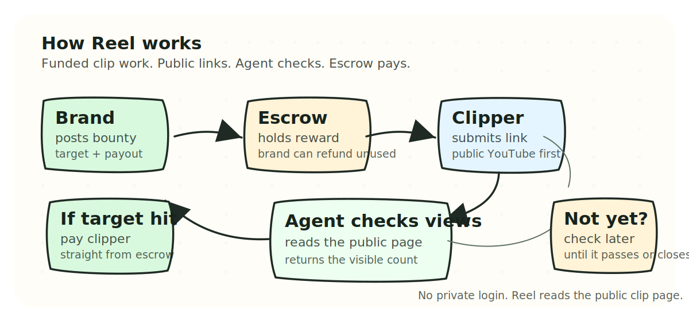

# Reel Pitch Deck

Plain deck for brands, clippers, partners, and early backers.

Logo: 

## 1. Reel

Agents pay clippers when results land.

Brands fund clip bounties. Clippers post public YouTube links. Reel checks the visible result and releases payment when the target is reached.

Speaker note: Open with the human version. "A brand wants clips. A clipper wants to know the money is real. Reel keeps both sides honest."

## 2. The Problem

Creator campaigns still run on trust.

- Brands pay before knowing what worked.
- Clippers chase vague promises.
- Results are checked by screenshots, DMs, or spreadsheets.
- Good clippers want paid work they can trust.

Speaker note: Keep this about pain, not infrastructure. The enemy is unclear payment, not a competitor.

Objection prep: If someone says brands already use agencies, answer that agencies still need cleaner proof and faster payout for smaller clipper campaigns.

## 3. Why Now

Short-form video is huge, and brands want proof before they spend more.

- YouTube says Shorts average over 200 billion daily views.
- IAB projects U.S. creator economy ad spend at $37 billion in 2025.
- Brands are moving from "post for awareness" to "pay for visible outcomes."

Speaker note: The timing is simple. The audience is massive, and marketing budgets are becoming more performance-driven.

## 4. The Product

Reel is a result bounty board for clippers.

- Brands create funded clip tasks.
- Clippers submit public YouTube links.
- An agent checks the visible views.
- Escrow pays when the clip hits the target.

Speaker note: Do not explain the chain. Say "the money is locked before the work starts, then paid by rule."

## 5. How It Works

Speaker note: Walk left to right. Brand funds. Clipper submits. Agent checks. Payment releases.

## 6. For Brands

Only pay for clips that reach the bar.

- Set the campaign.
- Set the view target.
- Set the reward.
- Fund the bounty.
- Close and recover unused funds.

Speaker note: The brand promise is control. They can see what they funded and what got paid.

## 7. For Clippers

Pick paid work, post the link, get paid when it hits.

- See funded bounties before starting.
- Submit a public YouTube URL.
- Let the agent check the view count.
- Receive payment directly when the target is met.

Speaker note: The clipper promise is confidence. No begging for payment after doing the work.

## 8. Why The Agent Matters

The agent is the checker, not the boss.

- It reads the public clip page.
- It returns the visible view count.
- It can check again later if the clip is still growing.
- It does not need a creator login.

Speaker note: This is the key trust point. The agent does not hold private accounts. It only reads public proof.

Objection prep: If someone asks about bad links, say the agent returns zero when the clip is private, unavailable, unrelated, or below the target.

## 9. What Is Live

Reel is already running as a working testnet product.

- Live app: <https://tryreel.vercel.app>
- Live contract: `0xd675eA5418b10888Ef74243c739831db85B42676`
- Brand and clipper roles are separate.
- YouTube view checks are live first.
- Scheduled rechecks are wired for clips that need more time.

Speaker note: Do not oversell traction. Say what exists, what is live, and what is being tested next.

Objection prep: If someone asks whether this is production-ready, answer that it is a live testnet build ready for pilots, not a mainnet launch.

## 10. Business Model

Reel takes a small fee when a clip gets paid.

Future paid layers:

- Higher check frequency for active campaigns.
- Brand team dashboards.
- Campaign templates for agencies.
- Premium verification rules for larger bounties.

Speaker note: Keep pricing flexible until pilot data shows what brands will pay for.

## 11. Go To Market

Start with YouTube clippers because the job is clear.

- Recruit clipper groups already making Shorts.
- Run pilot bounties for brands with clear offers.
- Publish payout stories after each campaign.
- Add other public social platforms after YouTube works reliably.

Speaker note: The wedge is not every creator platform. The wedge is paid YouTube clip work.

## 12. The Ask

Run the first real campaigns.

- 5 pilot brands.
- 100 active clippers.
- 30 days of funded bounties.
- Publish proof: clips submitted, clips paid, cost per result.

Speaker note: This is the immediate ask. If the audience is an investor, replace it with a raise amount, use of funds, and six-month milestone.

## Sources

- YouTube Blog, "The Future of YouTube 2026": <https://blog.youtube/inside-youtube/the-future-of-youtube-2026/>
- YouTube Blog, Neal Mohan at Cannes Lions 2025: <https://blog.youtube/news-and-events/neal-mohan-cannes-2025/>
- IAB, 2025 Creator Economy Ad Spend & Strategy Report: <https://www.iab.com/insights/2025-creator-economy-ad-spend-strategy-report/>
